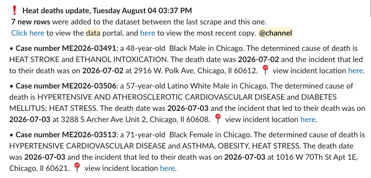

# Programmatically pulling heat-related deaths in Cook County

This is a project that came out of a need to cover heat-related deaths in Cook County (for WBEZ and the Chicago Sun-Times). As temperatures get hotter and hotter, and Chicago gets pummelled by wave after wave of extreme temperatures, more people are at risk of heat stroke and death from heat-related causes.

The newest data is available in [`today_heatdeaths.csv`](data/today_heatdeaths.csv). A daily archive of heat deaths is in [`./data/archive`](data/archive).

## What's available

The Cook County Medical Examiner's Office makes [a digital case archive](https://datacatalog.cookcountyil.gov/Health-Human-Services/Medical-Examiner-Case-Archive/cjeq-bs86/about_data) available on the Cook County Data Portal. That archive has all deaths within the county that fall under the Medical Examiner's jurisdiction. It also includes a flag, `heat_related`, that indicates whether a death is related to heat or environmental exposure.

At the start of the summer, the team was checking the dataset daily, sometimes multiple times a day, to see whether it updated with a new heat-related death. In lieu of doing that, this scraper was coded to check the data 

## How it works

`script.sh` runs the whole thing, which is triggered hourly by a cron job in Github Actions. Upon each deployment, `pull.py` runs and:
* Accesses the dataset
* Queries the data based on SoQL
* Downloads a copy of the raw data, as well as an archived version of that day's data
* Checks if there is any change between the last slice of data and the newest one
* Sends a Slack message to a designated channel within the newsroom's workspace that gives an update, with the current number of heat-related deaths.
* Cleans and processes the data for future analysis and visualizations

### Caveats
It isn't perfect, and this is primarily a measure to ensure that we don't have to check the data every day, as well as that we don't miss a new heat-related death added by the Medical Examiner in the portal.

Deaths are often added retroactively, so a new row doesn't inherently equal the most recent death. It's just the most recently-added death.

## How to run your own version
* Fork the repo
* Obtain an app token from the Cook County data portal in order to avoid rate-limiting from Socrata
* Set up a Slack app, create a channel to send messages to, then generate an incoming webhook url
* Set the app token and Slack webhook url as secrets within the repo
* Frequency of the job is set in the Actions `check.yml` file. Tweak as necessary.

### Hat tips to:
* Cody Winchester (https://github.com/ireapps/columbia-mo-dispatch-scraper/tree/main)
* Audrey Nielsen (https://github.com/nielsenau/socratips)
+ a lot a lot a lot of Stack Overflow posts